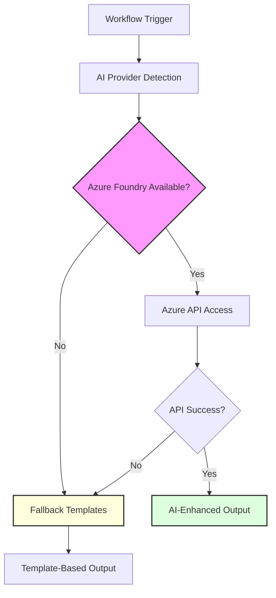
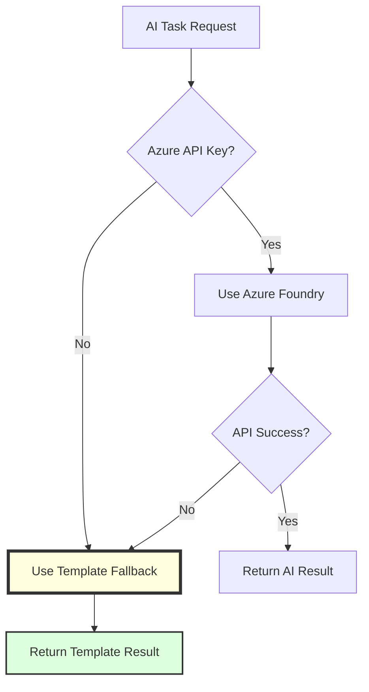

# AI Integration Architecture

The OSDU SPI Fork Management system uses optional Azure AI generation in synchronization workflows. AI improves commit messages and PR descriptions, but the sync, filter, cascade, build, and release paths do not depend on it.

## AI Integration Philosophy

<div class="grid cards" markdown>

-   :material-robot-outline:{ .lg .middle } **Enhancement, Not Dependency**

    ---

    AI capabilities enhance existing workflows without creating dependencies. All core functionality operates normally when AI services are unavailable, ensuring system reliability.

</div>

<div class="grid cards" markdown>

-   :material-microsoft-azure:{ .lg .middle } **Azure Foundry Primary**

    ---

    Standardized on Azure Foundry for enterprise compliance, Microsoft ecosystem integration, and consistent AI capabilities with graceful template fallback.

</div>

<div class="grid cards" markdown>

-   :material-shield-star:{ .lg .middle } **Secure by Design**

    ---

    API keys and sensitive data are handled through secure GitHub secrets management with proper access controls and audit trails.

</div>

<div class="grid cards" markdown>

-   :material-cash-multiple:{ .lg .middle } **Cost-Conscious Usage**

    ---

    Diff-size limits, command timeouts, and template fallback bound AI usage without blocking synchronization.

</div>

## AI Provider Architecture



## Supported AI Providers

The system uses Azure Foundry as the primary AI provider with graceful fallback to structured templates:

| Provider | Priority | Integration Method | Key Capabilities | Typical Use Cases |
|----------|----------|-------------|---------------|---------------|
| :material-microsoft-azure: **Azure Foundry** | Primary | AIPR with Azure credentials | Sync commit messages and PR descriptions | Upstream and template synchronization |
| :material-file-document: **Template Fallback** | Fallback | Workflow-owned Markdown | Consistent output without API access | Missing credentials, oversized diffs, timeouts, or API failures |

## AI Enhancement Points

### Pull Request Descriptions

AI-generated PR descriptions provide comprehensive change analysis:

```yaml
# AI-powered PR description generation
- Change categorization (feat, fix, chore, etc.)
- Impact analysis
- Breaking change detection
```

### Commit Message Generation

Intelligent conventional commit messages from changesets:

```bash
# AI analyzes changes and generates conventional commit
# Input: Git diff
# Output: "feat(sync): add duplicate PR prevention logic"
```

## Implementation Patterns

### Provider Detection Logic

```bash
# Automatic provider detection based on available credentials
USE_LLM=false
LLM_MODEL=""

# Check for Azure Foundry
if [[ -n "$AZURE_API_KEY" ]] && [[ -n "$AZURE_API_BASE" ]]; then
  USE_LLM=true
  LLM_MODEL="azure"
  echo "Using Azure Foundry for AI tasks"
else
  echo "No Azure Foundry configured - using templates"
fi
```


## Fallback Mechanisms

Robust fallback ensures workflow continuity:



## Security Considerations

### API Key Management

```yaml
# GitHub Secrets Configuration
secrets:
  AZURE_API_KEY:         # Azure Foundry API key (required for AI features)
  AZURE_API_BASE:        # Azure endpoint URL (required for AI features)
  AZURE_API_VERSION:     # Optional API version

# Access Control
- Repository-level secrets
```

### Data Privacy

Azure credentials are passed as GitHub secrets and are not available to the fallback path. The sync workflow limits AI description generation to diffs below 20,000 lines and runs AIPR with a timeout; larger or failed requests use the local template instead.


## Related Documentation

- [ADR-014: AI-Enhanced Development Workflow](../adr/014-ai-enhanced-development-workflow.md)
- [Workflow System Architecture](./workflow_system.md)
- [Synchronization Workflow](../workflows/synchronization.md)