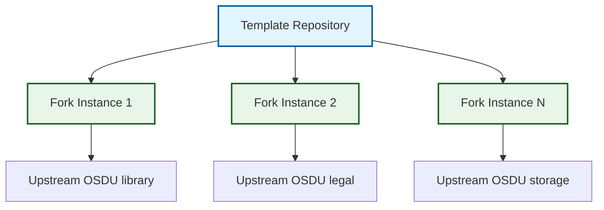

# Overview

## Principles

The OSDU SPI Fork Management system is built on **template-driven automation** that prioritizes guided initialization, controlled upstream integration, and continuous maintenance. The architecture uses GitHub-native workflows, issues, rulesets, releases, and packages.

-   :material-cog-clockwise:{ .lg .middle } **Self Configuring**

    ---

    An initialization issue captures the upstream repository, creates the branch topology, deploys fork workflows, and applies repository settings.

-   :material-shield-check:{ .lg .middle } **Safety First**

    ---

    Multiple validation points prevent unstable code promotion through the three-branch strategy, with branch protection rules and automated security scanning.

-   :material-lightning-bolt:{ .lg .middle } **Event Driven**

    ---

    Scheduled, pull-request, push, issue-comment, and manual events drive synchronization, validation, release, and recovery.

-   :material-trending-up:{ .lg .middle } **Scalable**

    ---

    Support unlimited repository deployments with consistent patterns, enabling enterprise-wide adoption across multiple OSDU repository forks.

## System Design

The system implements a sophisticated template repository pattern that separates concerns:

!!! info "Template Repository Pattern"
    This pattern separates template development from instance operation, enabling scalable management of unlimited fork deployments while maintaining consistent automation patterns.

**Template Development Context** includes `.github/workflows/` for template development and maintenance workflows, template-specific documentation and configuration, and update propagation mechanisms with testing frameworks.

**Fork Instance Context** receives the files from `.github/template-workflows/` as deployed `.github/workflows/`, plus fork-owned configuration, actions, and build assets.

**Event Driven Architecture** enables intelligent automation through GitHub's native event system. The system responds to scheduled events (daily sync), change events (PR validation), and manual events (on-demand resolution), providing comprehensive lifecycle management.

!!! tip "Architectural Success Pattern"
    The combination of template-driven deployment with event-driven automation creates a self-managing system that scales across unlimited fork instances while maintaining consistent behavior and zero-configuration operation.

**System Components** provide comprehensive automation through three specialized layers that work together to deliver fork management capabilities.

-   :material-source-branch:{ .lg .middle } **Three-Branch Strategy**

    ---

    Isolated conflict resolution and controlled integration from upstream through staging to production environments.

    [:octicons-arrow-right-24: Learn about branch strategy](three_branch_strategy.md)

-   :material-cog-clockwise:{ .lg .middle } **Workflow System**

    ---

    Event-driven automation with AI-enhanced capabilities for synchronization, validation, and release management.

    [:octicons-arrow-right-24: Explore workflow architecture](workflow_system.md)

-   :material-brain:{ .lg .middle } **AI Integration**

    ---

    Optional Azure AI support for sync commit messages and PR descriptions, with deterministic template fallback.

    [:octicons-arrow-right-24: Discover AI capabilities](ai_integration.md)

## Source and Artifact Ownership

The engineering system separates ownership rather than mirroring every upstream file:

- The sync workflow regenerates `fork_upstream` from the upstream tip, retaining shared code while removing provider implementations and upstream deployment assets.
- Azure provider and test source is seeded once, then owned on `main` and `fork_integration`.
- Validation builds `core,azure` by default; provider-less `fork_upstream` builds `core` only.
- The engineering system supplies `build/Dockerfile`, which packages the Azure JAR built from source.
- Trusted validation events publish multi-architecture images to public GHCR; release automation adds the semantic-version tag without rebuilding.

See [ADR-033](../adr/033-ghcr-as-service-image-registry.md), [ADR-035](../adr/035-azure-only-maven-profile.md), [ADR-037](../adr/037-engineering-system-owns-service-dockerfile.md), and [ADR-038](../adr/038-upstream-filter-transform.md).

## Enterprise Capabilities

The system combines repository rulesets, CodeQL, Dependabot validation, trusted-event package publication, and GitHub App authentication. Branch protection keeps human approval on `main` while allowing automation to maintain the integration branches.

!!! success "Enterprise Ready"
    Forks receive centrally maintained workflows and the canonical container recipe while retaining explicit ownership of service-specific Azure source and filter configuration.

---