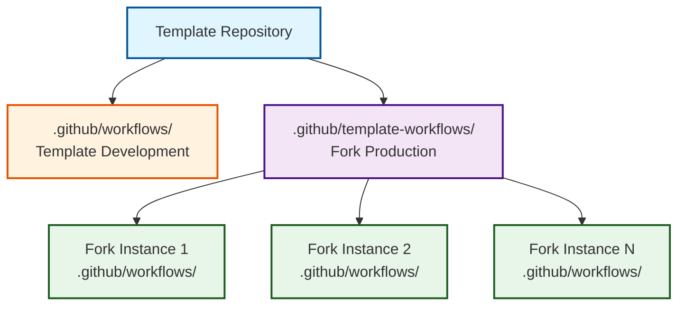
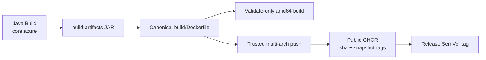
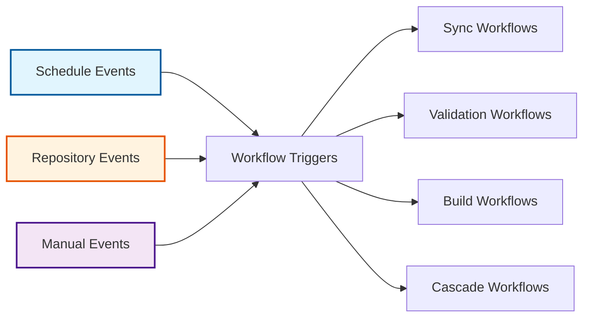

# Workflow System Architecture

The OSDU SPI Fork Management system implements a sophisticated workflow architecture that separates template development concerns from fork production operations. This design enables scalable deployment across multiple fork instances while maintaining centralized template management.

## Workflow Architecture Pattern

### Template-Workflows Separation

The system implements a clean separation between template development and fork production workflows:

-   :material-cog:{ .lg .middle } **Template Development Context**

    ---

    **`.github/workflows/` - Template management and maintenance**

    - Repository initialization and bootstrap workflows
    - Template testing and validation workflows
    - Template versioning and release management
    - Development CI/CD pipelines

-   :material-factory:{ .lg .middle } **Fork Production Context**

    ---

    **`.github/template-workflows/` - Production fork operations**

    - Upstream synchronization workflows
    - Build and validation workflows  
    - Release management for fork instances
    - Monitoring and maintenance workflows

## Core Workflow Categories

### :material-sync: Synchronization Workflows

-   :material-sync:{ .lg .middle } **Daily Upstream Sync** (`sync.yml`)

    ---

    Daily synchronization that filters the upstream tip into a reproducible provider-less tree, prevents duplicate PRs, and optionally uses Azure AI for conventional commit messages and PR descriptions

    - **Trigger**: Scheduled daily at midnight UTC with intelligent duplicate prevention
    - **Transform**: Keeps shared code, removes provider/deployment source, and injects references to fork-owned Azure modules
    - **Safety**: Halts when shared upstream content is unclassified or an expected kept path disappears
    - **Decision Logic**: Updates existing branches when upstream advances, prevents duplicates for same SHA
    - **Integration**: Three-branch safety pattern (fork_upstream → fork_integration → main)
    - **AI Features**: Intelligent change analysis and conventional commit generation
    - **Conflict Handling**: Automated detection with human-guided resolution

    [:octicons-arrow-right-24: Detailed spec](../workflows/synchronization.md)

-   :material-update:{ .lg .middle } **Template Propagation** (`sync-template.yml`)

    ---

    Distributes template improvements across multiple fork instances with selective synchronization and automated validation

    - **Trigger**: Daily scheduled execution at 8 AM UTC
    - **Scope**: Selective file synchronization based on configuration rules
    - **Safety**: Automated testing and validation before deployment
    - **Scalability**: Supports unlimited fork instances with consistent patterns

    [:octicons-arrow-right-24: Detailed spec](../workflows/synchronization.md)

### :material-check-circle: Validation Workflows

-   :material-check-circle:{ .lg .middle } **Pull Request Validation** (`validate.yml`)

    ---

    Comprehensive quality assurance system that enforces code standards, verifies build integrity, and ensures consistency across all changes

    - **Quality Gates**: Multi-phase validation pipeline with always-reporting summary checks
    - **Scope**: Semantic PR titles, branch status, Java build, canonical Dockerfile build, and trusted-event GHCR push
    - **Profiles**: `core,azure` by default; `core` for provider-less `fork_upstream`
    - **Intelligence**: Context-aware validation for different contribution types
    - **Feedback**: Detailed status reporting with actionable developer guidance

    [:octicons-arrow-right-24: Detailed spec](../workflows/validation.md)

-   :material-robot-excited:{ .lg .middle } **Dependabot Automation** (`dependabot-validation.yml`)

    ---

    Dedicated build and image validation with failure tracking for Dependabot pull requests

    - **Automation**: Runs one reusable Java build with coverage, then validates the service image
    - **Feedback**: Posts the build result to the pull request
    - **Failure Handling**: Labels the PR and opens a `human-required` issue
    - **Integration**: Keeps automated dependency updates out of the regular validation build lane

    [:octicons-arrow-right-24: Detailed spec](../workflows/validation.md)

### :material-hammer-wrench: Build & Release Workflows

-   :material-hammer-wrench:{ .lg .middle } **Project Build** (`build.yml`)

    ---

    Java/Maven feature-branch build verification with tests, JaCoCo reporting, and short-lived JAR artifacts

    - **Focus**: Rapid developer feedback for feature branch development
    - **Coverage**: Unit tests and JaCoCo report artifacts
    - **Performance**: Maven caching and docs/config path exclusions
    - **Boundary**: Container validation and publication belong to `validate.yml`, not `build.yml`

    [:octicons-arrow-right-24: Detailed spec](../workflows/build.md)

-   :material-tag:{ .lg .middle } **Semantic Release** (`release.yml`)

    ---

    Automated semantic versioning with conventional commit analysis, changelog generation, and coordinated release distribution

    - **Versioning**: Release Please integration with conventional commit standards
    - **Coordination**: Upstream version tracking and alignment strategies
    - **Documentation**: Automated changelog and release notes generation
    - **Distribution**: Upstream correlation tags and registry-side SemVer tagging of the existing GHCR image

    [:octicons-arrow-right-24: Detailed spec](../workflows/release.md)

### :material-water-outline: Cascade Workflows

-   :material-water-outline:{ .lg .middle } **Integration Cascade** (`cascade.yml`)

    ---

    Multi-stage integration workflow that safely promotes changes through the three-branch strategy with comprehensive validation

    - **Flow**: Systematic progression from fork_upstream → fork_integration → main
    - **Safety**: Comprehensive testing and validation at each integration stage
    - **Flexibility**: Manual execution with automated monitoring capabilities
    - **Tracking**: Complete progress monitoring through GitHub Issues

    [:octicons-arrow-right-24: Detailed spec](../workflows/cascade.md)

-   :material-monitor-eye:{ .lg .middle } **Cascade Monitoring** (`cascade-monitor.yml`)

    ---

    Monitoring system that detects completed synchronizations and dispatches cascade or recovery operations

    - **Detection**: Automated monitoring for completed upstream synchronizations
    - **Schedule**: Six-hour safety-net checks for missed events and stale conflicts
    - **Escalation**: Proactive alerts and notifications for overdue operations
    - **Recovery**: Retries failure issues after maintainers mark them ready

    [:octicons-arrow-right-24: Detailed spec](../workflows/cascade.md)

## Service Image Lifecycle

The engineering system owns the Dockerfile and entrypoint. The Docker action packages the JAR produced by the Java job; it never runs Maven or downloads the service's own binary. Untrusted PR validation has no registry credentials. Trusted events publish `linux/amd64` and `linux/arm64` images to public GHCR, and release automation retags the immutable release-commit image.

## Workflow Event Architecture

### Event-Driven Triggers

| Trigger Type | Workflow | Schedule/Event | Description |
|-------------|----------|----------------|-------------|
| **Scheduled** | Daily Sync | `0 0 * * *` | Midnight UTC upstream synchronization with duplicate prevention |
| **Scheduled** | Template Sync | `0 8 * * *` | Daily 8 AM UTC template updates with duplicate prevention |
| **Scheduled** | Monitoring | `0 */6 * * *` | 6-hour cascade monitoring |
| **Event-Based** | PR Validation | PR creation/updates | Validation workflows on pull requests |
| **Event-Based** | Cascade Monitor | Sync PR merged | Dispatches cascade after merge to `fork_upstream` |
| **Event-Based** | Build | Feature push or protected-branch PR | Java developer feedback |
| **Event-Based** | Release | Push to `main` | Release Please and GHCR SemVer tagging |
| **Manual** | Emergency Sync | On-demand | Immediate upstream synchronization |
| **Manual** | Cascade Override | On-demand | Manual cascade operation initiation |
| **Manual** | Template Update | On-demand | Immediate template propagation |
| **Manual** | Validation Retry | On-demand | Re-execution of failed workflows |

## Workflow Integration Patterns

### AI-Enhanced Automation

-   :material-microsoft-azure:{ .lg .middle } **Azure Foundry**

    ---

    Optional AIPR provider for synchronization commit messages and PR descriptions

-   :material-file-document:{ .lg .middle } **Template Fallback**

    ---

    Workflow-owned output used when Azure credentials are absent, the diff is too large, or generation fails

**AI-Powered Capabilities** are limited to synchronization:

- **Change Analysis**: Intelligent assessment of upstream modifications
- **Commit Generation**: Conventional commit message creation
- **PR Descriptions**: Comprehensive pull request documentation
- **Fallback**: Deterministic descriptions keep synchronization operational without AI

### Security Integration

!!! warning "Security-First Approach"
    Security responsibilities are separated across CodeQL, Dependabot validation, repository rulesets, pinned actions, and trusted-event package permissions.

-   :material-shield-search:{ .lg .middle } **Automated Security Scanning**

    ---

    - CodeQL analysis with a stable required summary check
    - Dependabot update validation
    - Registry writes restricted to trusted events
    - Pinned third-party workflow actions

-   :material-shield-check:{ .lg .middle } **Branch Protection Integration**

    ---

    - Required workflow completion before merge
    - Mandatory human approval for production changes
    - Prevention of unauthorized direct pushes
    - Controlled override procedures for critical issues

## Workflow State Management

### Issue-Based Tracking

#### **Lifecycle Management**
- **State Tracking**: GitHub Issues for workflow state management
- **Progress Updates**: Automated status updates throughout workflow execution
- **Error Reporting**: Detailed failure analysis and resolution guidance
- **Audit Trail**: Complete record of all workflow operations

#### **Label-Based Organization**
- **Workflow Types**: `upstream-sync`, `template-sync`, `release-tracking`
- **Status Indicators**: `cascade-active`, `cascade-blocked`, `validation-failed`
- **Priority and recovery**: `high-priority`, `cascade-ready`, `needs-resolution`
- **Assignment Strategy**: `human-required` for manual intervention points

### Performance Optimization

-   :material-lightning-bolt:{ .lg .middle } **Intelligent Caching**

    ---

    - Maven dependencies
    - Docker build layers
    - Short-lived JAR and coverage artifacts

-   :material-speedometer:{ .lg .middle } **Resource Management**

    ---

    - Concurrent workflow execution where safe
    - Concurrency groups for sync, cascade, and deployment operations
    - Timeouts and deterministic fallback around optional AI generation

## Reusable Actions

- **Java Build**: Maven build, tests, coverage, and JAR artifacts
- **Docker Build**: Canonical image build and trusted GHCR publication
- **Upstream Filter**: Generate, verify, seed, and stamp modes
- **State and PR Status**: Duplicate prevention and workflow feedback

---